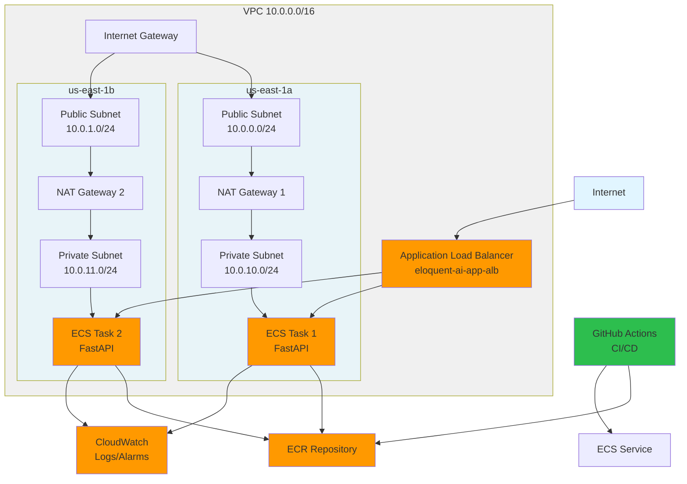

# DevOps Technical Challenge

FastAPI application deployed to AWS ECS with Terraform IaC and GitHub Actions CI/CD.

## Architecture

Multi-AZ deployment across us-east-1a and us-east-1b:



**Components**: VPC • ECS Fargate (2 tasks) • ALB • ECR • CloudWatch • IAM • NAT Gateways • Security Groups


## Prerequisites

AWS CLI (configured), Terraform 1.6+, Docker, Python 3.11+

## Local Testing

```bash
# Python
pip install -r requirements.txt && python app.py

# Docker  
docker build -t app . && docker run -p 8080:8080 app

# Test endpoints
curl http://localhost:8080/health
curl http://localhost:8080/api/hello
```

## AWS Deployment

```bash
# Deploy infrastructure
cd terraform && terraform init && terraform apply

# Add GitHub secrets for CI/CD (get from terraform output)
# - AWS_ACCESS_KEY_ID
# - AWS_SECRET_ACCESS_KEY  
# - AWS_REGION

# Push code to trigger automatic deployment
git push origin main

# Test live application
curl $(terraform output -raw alb_url)/health

# Cleanup
terraform destroy
```

## CI/CD Pipeline

Automated on push to `main`: Lint → Test → Build → Push to ECR → Deploy to ECS → Rollback on failure

## Security

**Current**: Private subnets, security groups, IAM roles, ECR encryption, ⚠️ HTTP only (no HTTPS)

**Production**: Add HTTPS/ACM, WAF, Secrets Manager, OIDC for GitHub Actions

## Monitoring

CloudWatch logs: `/ecs/eloquent-ai-app` | Alarms: CPU, Memory, Health | Container Insights enabled

```bash
aws logs tail /ecs/eloquent-ai-app --follow
```

## Design Decisions & Trade-offs

| Decision | Rationale | Trade-off |
|----------|-----------|-----------|
| **Fargate over EC2** | Serverless, no server management | +20% cost, less operational overhead |
| **Multi-AZ (2 zones)** | High availability | 2x NAT Gateway costs ($65/mo), AZ failure resilience |
| **Private subnets** | Better security | Requires NAT Gateways |
| **ALB over NLB** | HTTP routing, health checks | Higher cost, better L7 features |
| **Local Terraform state** | Simplicity | Not team-ready (use S3+DynamoDB for prod) |
| **GitHub Actions** | Native integration, no infra | Less flexible than Jenkins, simpler |
| **IAM user credentials** | Simple setup | Manual rotation needed (use OIDC for prod) |

## Brief Cost Analysis

~$115/month: NAT ($65) + ALB ($20) + Fargate ($25) + CloudWatch ($5). Run `terraform destroy` to stop charges.


### Production Improvements / Future Considerations

**Security**: HTTPS/ACM + custom domain, WAF, OIDC, Secrets Manager, GuardDuty

**Infrastructure**: S3/DynamoDB Terraform state, blue/green deploys, proper backup/DR

**Observability**: X-Ray tracing, structured logging, Grafana dashboards, APM

**Cost**: VPC endpoints, Fargate Spot (70% savings), auto-scaling, single-AZ dev/staging

**DevEx**: Pre-commit hooks, branch protection, Dependabot, ephemeral PR environments

---

## Troubleshooting

```bash
# Service status
aws ecs describe-services --cluster eloquent-ai-app-cluster --services eloquent-ai-app-service

# Logs
aws logs tail /ecs/eloquent-ai-app --follow

# ALB health
aws elbv2 describe-target-health --target-group-arn $(aws elbv2 describe-target-groups --names eloquent-ai-app-tg --query 'TargetGroups[0].TargetGroupArn' --output text)
```
